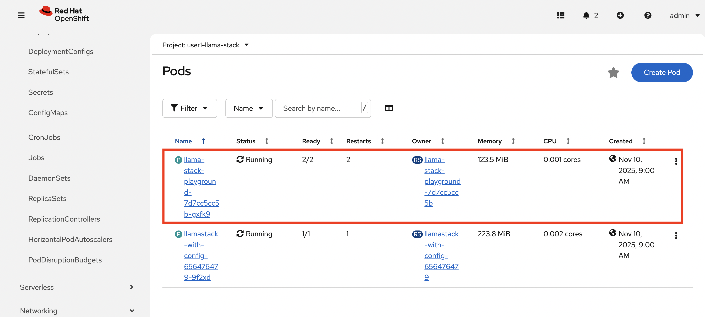
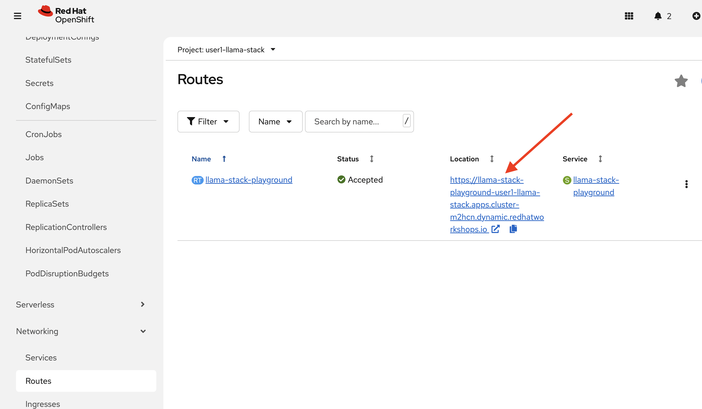
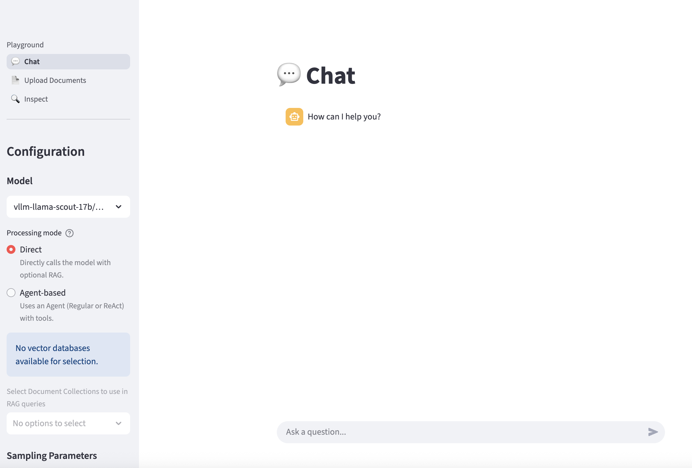
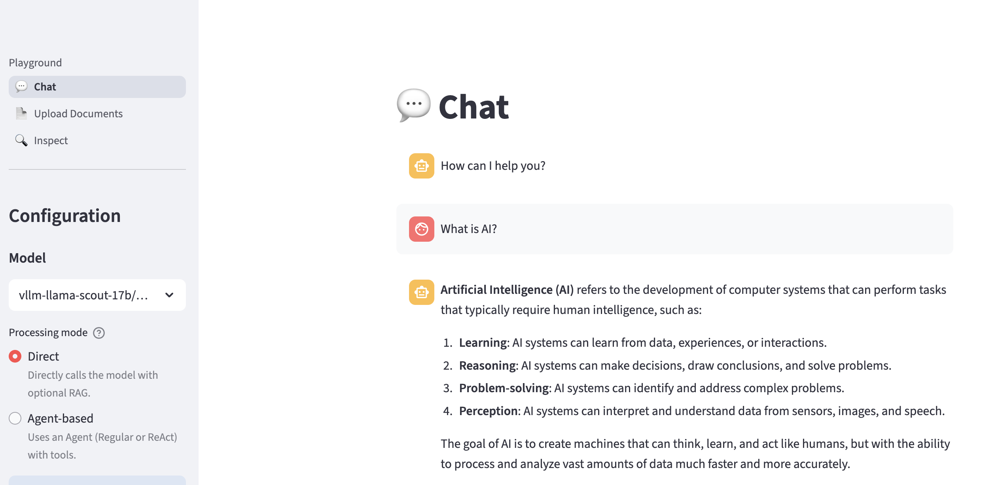
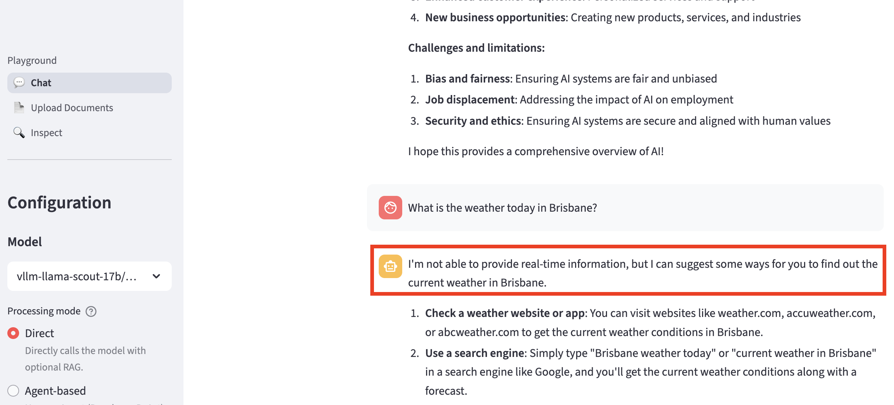

# Introducing Llama Stack

In order to build and run our CI/CD agent, we'll need a number of components:

- An **LLM** for analyzing the CI/CD pipeline logs and generating recommendations. We'll leverage a Granite model hosted remotely via a Models-as-a-Service interface.
- A **graphical user interface** for interacting with the LLM and experimenting with prompts and agentic capabilities. We'll use the Llama Stack Playground.
- An **agentic framework** for building the agent as an application. We'll rely on the Llama Stack agents API.
- Access to **third-party systems**: the CI/CD runtime (OpenShift Pipelines), web search for troubleshooting, and GitHub for issue tracking.
- A central **API server** to orchestrate agent-model-tool interactions — this is where **Llama Stack** comes in.

In this chapter we'll get familiar with Llama Stack and the Playground by prompting against the model, setting up the foundation for tool integration in the next module.

## Llama Stack

[Llama Stack](https://llama-stack.readthedocs.io/en/latest/) is an open-source framework and API layer for building and running generative AI applications. It provides a unified set of APIs for inference, RAG, agents, tools, safety, evals, and telemetry. Llama Stack is one of the components included in Red Hat AI.

There's a Llama Stack instance that's running in your lab environment. We will use this instance:

- From this showroom through the Llama Stack CLI client
- Interactively from the Llama Stack Playground frontend, running as a container on the cluster
- And programmatically from the agent service through the Llama Stack Python SDK. Note that since Llama Stack implements the OpenAI API, any library that consumes the OpenAI API can be used as a client.

### Verify the Llama Stack Connection

1. Configure the **llama-stack-client** in your showroom terminal and verify connectivity.

```bash
llama-stack-client configure
```

For the endpoint of the Llama Stack distribution server enter:

```bash
http://<USER_NAME>-llama-stack-service.<USER_NAME>-llama-stack.svc.cluster.local:8321
```

When prompted for the API key, leave the value empty and hit enter.

2. Verify the connection:

```bash
llama-stack-client inspect version
```

You should see a successful response with the server version. You can also explore `llama-stack-client --help` and commands like `providers list` or `models list` to inspect your distribution.

### Playground: Llama Stack User Interface

Llama Stack comes with a simple UI called Playground. For this lab, a Playground instance is already deployed for each user within the `<USER_NAME>-llama-stack` namespace.

Select the *<USER_NAME>-llama-stack* namespace.

1. Checkout the Playground pod.



2. Click on the route for this pod to access the Playground.



3. Here is the Playground GUI for interacting with Llama Stack services.



4. Let's first chat with the LLM by asking a question such as:

```text
What is AI?
```



5. Now let's ask the LLM a question for which it lacks information (e.g. real-time data):

```text
What is the weather today in Brisbane?
```



6. In order to find this type of real-time information, the LLM needs to call a tool like *websearch*. In the next module, we'll configure all the tools our agent needs — websearch, OpenShift, and GitHub — along with observability telemetry, in a single configuration update.
