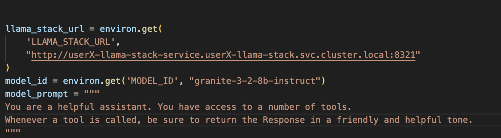
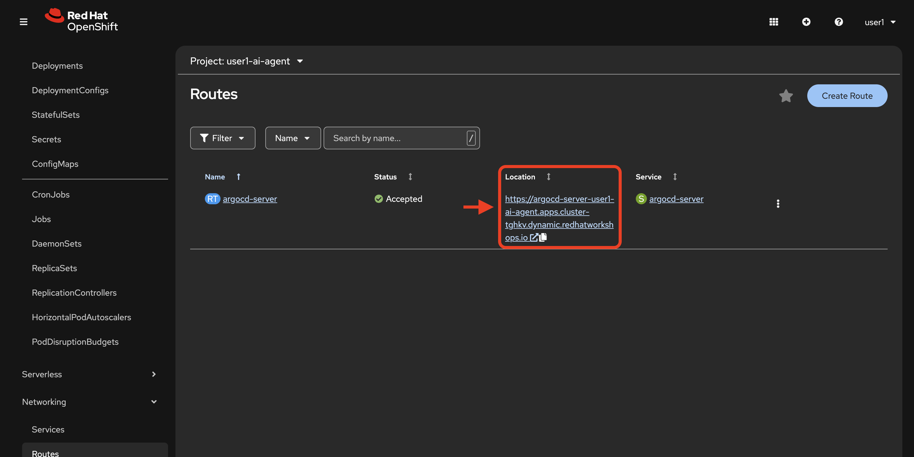

# From Playground to Prototype - Building Your Agent in Red Hat AI

> **Important:** In this lab, you will build an agent, and manage it through ArgoCD. You will then create a pipeline to trigger the agent to create a GitHub issue in your forked repository from previous modules.

## Inspect the agent files

1. In your preferred terminal environment, open `agent/code/agent.py` from your forked repository and view the contents. This file contains the core agent logic. Note the following:

   1. **Multi-tool architecture (lines 52-59)**

      - Agent uses 3 MCP tool groups that we've previously configured: openshift, websearch, and github
      - Demonstrates how to combine infrastructure monitoring, web search, and issue tracking
      - Uses ReActAgent pattern for reasoning and tool selection

   2. **Prompt engineering patterns (lines 69-94)**

      - few-shot examples teach the agent expected output format
      - structured output format guides the agent's behavior
      - {{ = Literal { in output (for showing JSON examples to the AI)
      - {variable} = Gets replaced with actual runtime value
      - .format() = Cleaner separation between "example text" and "runtime variables"
      - This pattern prevents Python formatting errors while teaching the AI the exact JSON structure to output

   3. **{container_name} and {pod_name} variables ensure you get the necessary logs from a PipelineRun**

      - Line 90: prompt asks for logs from `{container_name}`
      - The correct names must be passed from the pipeline to ensure you get the correct logs. PipelineRun pods have multiple containers to account for.

   4. **Error handling (103-123, 125-160)**

      - Fallback prompts if formatting fails
      - Detailed logging for debugging

2. Once you understand how the agent works, edit the `agents.py` file with your correct username.



3. Save the file. Then, view the `agent/code/main.py` file to understand how the agent is triggered.

Overall, the system works as a GitOps remediation / failure triage agent:

- FastAPI server receives failure notifications
- Agent analyzes a specific failed container logs in an OpenShift pod using MCP tools
- Searches for solutions via web search
- Creates GitHub issues with error summaries and solutions

## Trigger pipeline to build the agent image

1. In your chosen terminal environment, create a PipelineRun using the following command:

> **Note:** Edit the file in the below command with the appropriate variables. Then, ensure the forked repository location is accurate in the command.

```bash
oc -n <USER_NAME>-ai-agent create -f etx-agentic-ai-gitops/lab-resources/agent-service-build-run.yaml
```

2. View the pipelinerun status either in the UI or by command:

```bash
# List all PipelineRuns to find the generated name
oc -n <USER_NAME>-ai-agent get pipelineruns
# Watch the PipelineRun status
oc -n <USER_NAME>-ai-agent get pipelineruns -w
```

## Deploy the agent with ArgoCD

Now we will create a new Argo app that pulls the agent helm chart from your forked repository in GitHub.

1. In your chosen terminal, with your preferred editor, edit the `values.yaml` file found in `etx-agentic-ai-gitops/agent/chart/`

```bash
vim etx-agentic-ai-gitops/agent/chart/values.yaml
```

2. Replace the values for your OpenShift username and your GitHub user handle as we've done in the example below:

```yaml
namespace: user1-ai-agent
registry: image-registry.openshift-image-registry.svc:5000
application_name: ai-agent

# Agent Configuration
agentConfig:
  clientTimeout: "600.0"
  llamaStackUrl: "http://user1-llama-stack-service.user1-llama-stack.svc.cluster.local:8321"
  maxInferIterations: "50"
  maxTokens: "5000"
  modelId: "granite-3-2-8b-instruct"
  temperature: "0.0"
  githubOwner: "taylorjordanNC"
```

3. Commit your `values.yaml` file changes to your fork.

4. Edit the variables within the `etx-agentic-ai-gitops/lab-resources/ai-agent-app.yaml` file. For namespace set `<USER_NAME>-ai-agent` and for GitHub repository set your forked repo location.

5. Create a new argo application from your command line with the following command (you may choose to create the app via the UI as well if you prefer). **Do not forget** to edit the variables in the file before deploying.

```bash
oc apply -f etx-agentic-ai-gitops/lab-resources/ai-agent-app.yaml
```

### Check on application with CLI or ArgoCD UI

```bash
oc get apps -o wide
```

1. Get route for user-scoped argo instance:

```bash
oc -n user${YOUR_USER_NUMBER}-ai-agent get routes
```

or in the UI:



2. Verify health of app and associated agent pod running

## Test your agent's function with our demo pipeline

We will now test the MCP and model integrations from the playground in the context of your newly deployed agent.

This demo application pipeline models a common CI/CD flow with automated failure recovery. The pipeline has 3 core tasks:

- **fetch-repository**: The git-clone task pulls your forked repo at a specific revision. This revision contains an intentional build error that will trigger the agent.
- **build**: Attempts to build the Java application and push it to the internal registry using the `step-s2i-build` container. This task has two retries built in before failing.
- **trigger-agent**: A Tekton `finally` task that always runs regardless of pipeline success or failure. When the pipeline fails, this task identifies the failed pod and calls the AI agent API, passing key variables: namespace, pod name, and container name.

This demonstrates how agentic AI can be integrated into typical CI/CD pipelines to manage failures in an automated, streamlined way.

Let's test the agent!

### Apply the pipeline resource

Using your terminal or the (+) button in the web console, apply the following pipeline resource with your user number substituted into the metadata/namespace placeholder:

> **Important:** You will need to edit the file directly. Don't forget!

```bash
oc apply -f etx-agentic-ai-gitops/lab-resources/demo-pipeline.yaml
```

### Trigger the pipeline

1. Edit the `lab-resources/demo-pipeline-run.yaml` file, substituting your user number where applicable in the file.

2. Create the PipelineRun:

```bash
oc -n <USER_NAME>-ai-agent create -f etx-agentic-ai-gitops/lab-resources/demo-pipeline-run.yaml
```

3. Monitor the PipelineRun:

```bash
oc -n user${YOUR_USER_NUMBER}-ai-agent get pipelineruns -w
```

The pipeline will fail on the build step, which will trigger the `finally` step which calls the agent service to analyze the failure and create a GitHub issue.

4. Confirm pipelinerun detailed failure:

```bash
oc get taskrun -l tekton.dev/pipelineRun=java-app-build-run-{UNIQUE_ID}
```

5. Verify in your forked repository that the issue was successfully generated.

## What's Next

Congratulations! With your agent running as a service and integrated with the pipeline trigger, you have established the foundation for a production-ready workflow.

This setup demonstrates:

- **Automated failure response**: When pipelines fail, your agent automatically analyzes logs and creates GitHub issues
- **Reduced MTTR**: Mean time to resolution decreases as issues are identified and documented immediately
- **Extensible architecture**: The same pattern can be applied to other pipelines and failure scenarios

### Advanced possibilities

Now that you understand the pattern, consider these potential extensions:

- Add the agent as a `finally` task in your agent build pipeline to create self-healing CI/CD
- Integrate additional tools via MCP (monitoring systems, ticketing platforms, etc.)
- Enhance the agent prompt to suggest automated fixes, not just documentation

### Coming up next

Now that the agent is running and producing real interactions, we'll use the distributed tracing we configured earlier to observe agent behavior, understand where time is spent, and identify optimization opportunities.
